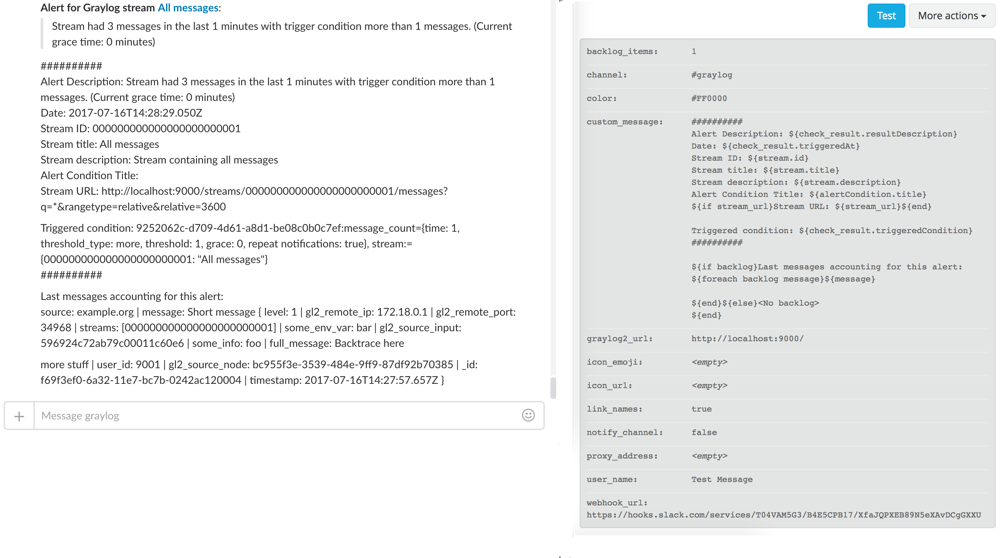
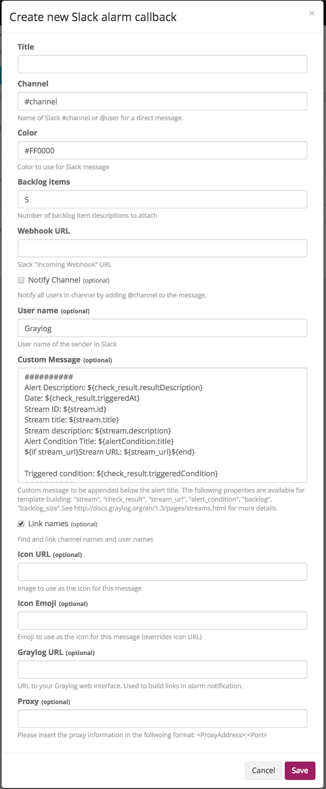

Slack/Discord/Mattermost Plugin for Graylog
========================

[](https://github.com/graylog-labs/graylog-plugin-slack/releases)
[](https://github.com/graylog-labs/graylog-plugin-slack/releases)
[](https://travis-ci.org/graylog-labs/graylog-plugin-slack)

**Required Graylog version:** 2.0 and later.

Please use version 2.1.0 of this plugin if you are still running Graylog 1.x

#### Detailed alarm notification and message output:




This plugin can notify [Slack](https://www.slack.com), [Discord](https://discordapp.com) or [Mattermost](http://www.mattermost.org) channels about triggered alerts in Graylog (Alarm Callback) and also forward each message routed into a stream (Message Output) in realtime.

#### Short mode message output:


Great for streams with higher message throughput. The screenshot shows the output of a nightly task that updates information of the Graylog Marketplace.

## Changes in v3.0

* Templated message are now supported. They use the same format as email alerts.


## Installation

[Download the plugin](https://github.com/Graylog2/graylog-plugin-slack/releases)
and place the `.jar` file in your Graylog plugin directory. The plugin directory
is the `plugins/` folder relative from your `graylog-server` directory by default
and can be configured in your `graylog.conf` file.

Restart `graylog-server` and you are done.

## Usage

### For Slack:

#### Step 1: Create Slack Incoming Webhook

Create a new Slack Incoming Webhook (`https://<organization>.slack.com/services/new/incoming-webhook`) and copy the URL it will present to you. It will ask you to select a Slack channel but you can override it in the plugin configuration later.

### For Discord:

#### Step 1: Create Discord Webhook

For create a new Discord Webhook follow part 1 of [this guide](https://support.discordapp.com/hc/en-us/articles/228383668-Intro-to-Webhooks) to create and retrieve a webhook URL for a specific channel and copy the URL it will present to you. 
Add /slack to end of webhook url. (/webhooks/{webhook.id}/{webhook.token}/slack) and create  a "Slack alarm callback"

### For Mattermost:

#### Step 1: Create Mattermost Incoming Webhook

Enable Webhooks in general and create an incoming Webhook for Graylog as described in the [Mattermost docs](http://docs.mattermost.com/developer/webhooks-incoming.html).

#### Step 2: Create alarm callback or message output

Create a "Slack alarm callback" on the "Manage alerts" page of your stream. Enter the requested configuration (use the Incoming Webhook URL you created in step 1) and save. Make sure you also configured alert conditions for the stream so that the alerts are actually triggered.

The same applies for message outputs which you can configure in *Stream* - > *Manage Outputs*.

## Troubleshooting

### HTTPS connection fails

If the Java runtime environment and the included SSL certificate trust store is too old, HTTPS connections to Slack might fail with the following error message:

```text
Caused by: javax.net.ssl.SSLHandshakeException: sun.security.validator.ValidatorException: PKIX path building failed: sun.security.provider.certpath.SunCertPathBuilderException: unable to find valid certification path to requested target
```

In this case, add the Slack SSL certificate manually to Java's trust store similar to the process described in the [Graylog documentation](http://docs.graylog.org/en/2.1/pages/configuration/https.html#adding-a-self-signed-certificate-to-the-jvm-trust-store).


## Build

This project is using Maven and requires Java 8 or higher.

You can build a plugin (JAR) with `mvn package`.

DEB and RPM packages can be build with `mvn jdeb:jdeb` and `mvn rpm:rpm` respectively.

## Plugin Release

We are using the maven release plugin:

```
$ mvn release:prepare
[...]
$ mvn release:perform
```

This sets the version numbers, creates a tag and pushes to GitHub. TravisCI will build the release artifacts and upload to GitHub automatically.
